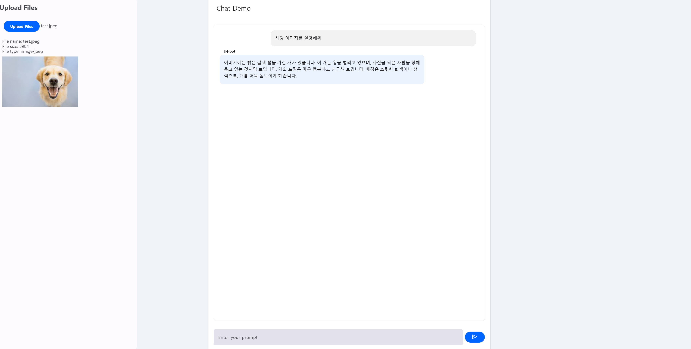
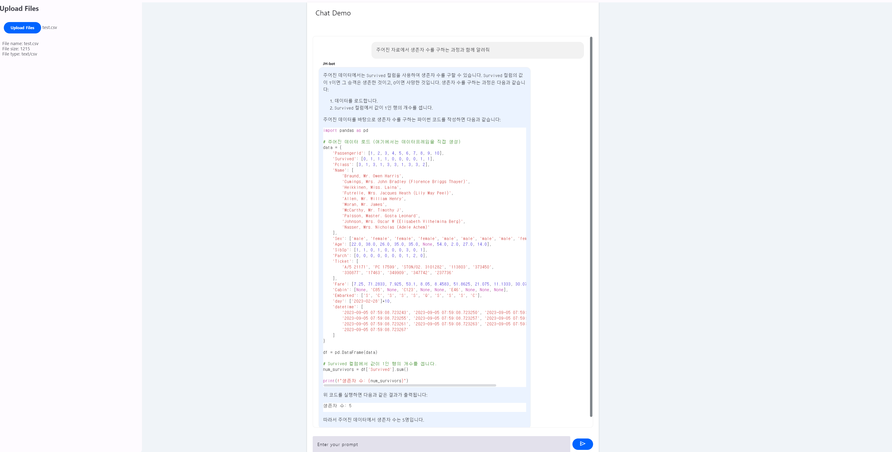
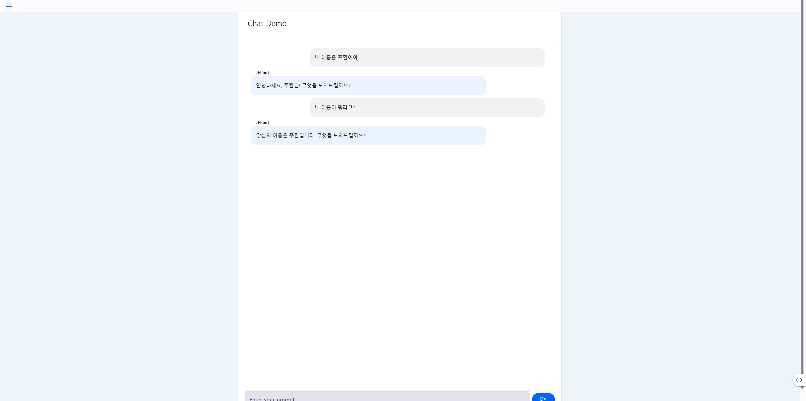

# llm-chat

[](https://www.python.org/downloads/release/python-3117/)

```
expert OPENAI_API_KEY=[YOUR API KEY]
expert BASE_PATH=[YOUR PATH]
```

```
$ python3.11 -m venv [Directory]
$ source bin/activate
$ pip install -r requirements.txt
$ cd src
$ mesop main.py
```

### image



### csv



### history


